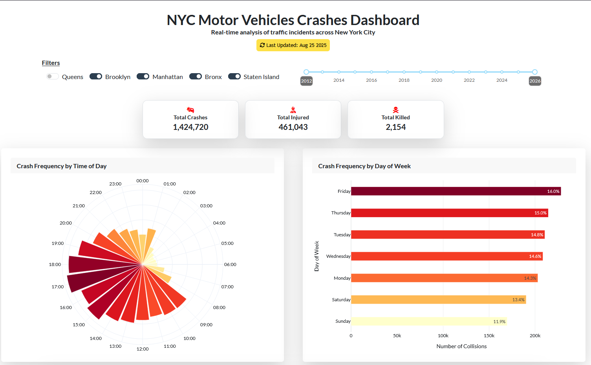

## NYC Traffic Collisions Dashboard - [Visit site](https://smolurl.com/KMjvNd)

An interactive dashboard visualizing motor vehicle collision trends across New York City’s boroughs and over time.

### Tech Stack

Python, Dash, Plotly, GeoPandas, DuckDB, SQL

#### Data Source - [Visit NYC Open Data](https://opendata.cityofnewyork.us/)
